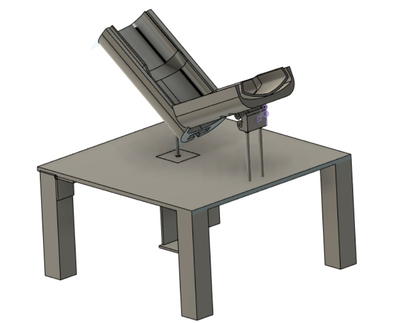
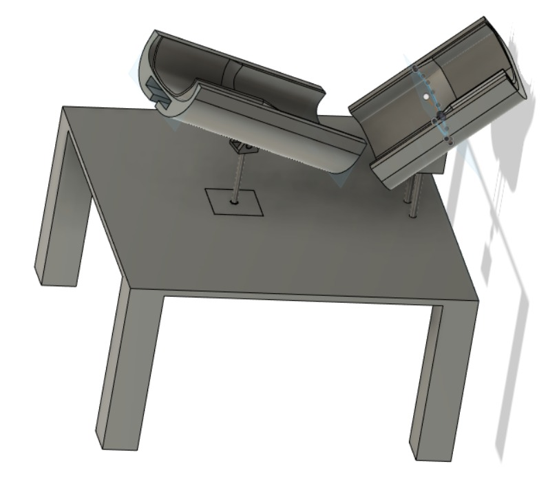
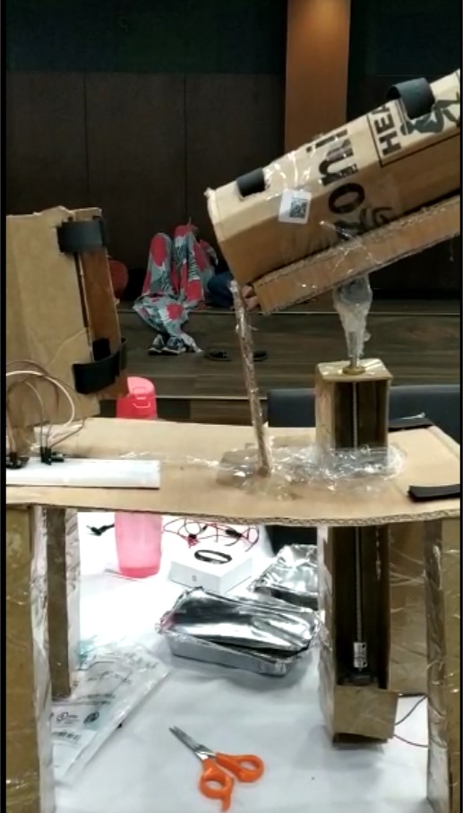

# Ottopedic

     

Device for assisting during physiotherapy which can be operated remotely by a doctor.

Ottopedic is a device which can be used by doctors anywhere in the world to check stats of how the patient is doing remotely and set which exercise he is supposed to be doing and how many times is he supposed to do them

The CAD files for the  design can be found here: [CAD files!](https://a360.co/2SYAvSb)

Components used were:
* ESP32
* L293D motor driver
* DC Geared motor
* 3d printer

## CAD Design of the product

### Final prototype

## Made By:
* [Pulkit Mahajan](https://github.com/pulkitmahajan23)
* [Suyash Agarwal](https://github.com/suagar10)
* [Ayush Bhushan](https://github.com/mechieanic)
* [Simran Gangwani](https://github.com/crabsim)
